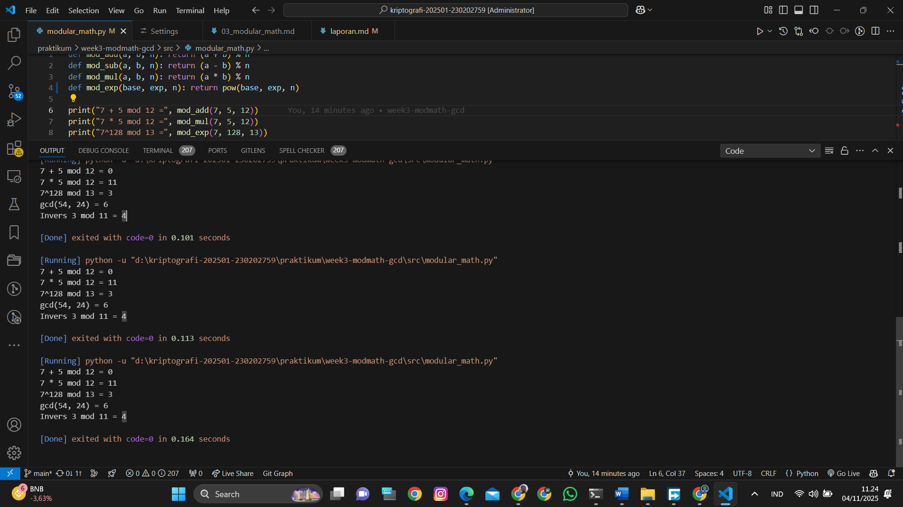

# Laporan Praktikum Kriptografi
Minggu ke-: 3
Topik: Modular Math (Aritmetika Modular, GCD, Bilangan Prima, Logaritma Diskrit)
Nama: Jamaludin
NIM: 230202759
Kelas: 5IKRB

---

## 1. Tujuan
Setelah mengikuti praktikum ini, mahasiswa diharapkan mampu:
1. Menyelesaikan operasi aritmetika modular.
2. Menentukan bilangan prima dan menghitung GCD (Greatest Common Divisor).
3. Menerapkan logaritma diskrit sederhana dalam simulasi kriptografi.

---

## 2. Dasar Teori
Aritmetika modular adalah cabang matematika yang mempelajari operasi pada bilangan bulat modulo n, di mana hasil operasi dibagi dengan n dan sisanya menjadi hasil akhir. Operasi dasar meliputi penjumlahan, pengurangan, perkalian, dan eksponensiasi modular. GCD (Greatest Common Divisor) adalah bilangan bulat positif terbesar yang membagi dua bilangan tanpa sisa, dan dapat dihitung menggunakan algoritma Euclidean. Algoritma Euclidean bekerja dengan mengurangi bilangan yang lebih besar dengan kelipatan bilangan yang lebih kecil hingga mencapai sisa nol. Extended Euclidean Algorithm digunakan untuk mencari invers modular, yang penting dalam kriptografi untuk algoritma seperti RSA. Logaritma diskrit adalah masalah mencari x sehingga a^x ≡ b (mod n), yang sulit untuk modulus besar dan menjadi dasar keamanan beberapa sistem kriptografi.

---

## 3. Alat dan Bahan
- Python 3.11 atau lebih baru
- Visual Studio Code / editor lain
- Git dan akun GitHub
- Library tambahan: tidak diperlukan (menggunakan built-in Python)

---

## 4. Langkah Percobaan
1. Membuat folder praktikum/week3-modmath-gcd/src/ jika belum ada.
2. Membuat file modular_math.py di folder src/.
3. Menyalin kode program dari panduan praktikum ke dalam file.
4. Menjalankan program dengan perintah `python modular_math.py` di terminal.
5. Menyimpan output eksekusi ke file output.txt.
6. Mengambil screenshot hasil eksekusi dan menyimpannya di folder screenshots/.
7. Mengisi laporan.md dengan hasil percobaan.
8. Melakukan commit dengan pesan "week3-modmath-gcd".

---

## 5. Source Code
```python
def mod_add(a, b, n): return (a + b) % n
def mod_sub(a, b, n): return (a - b) % n
def mod_mul(a, b, n): return (a * b) % n
def mod_exp(base, exp, n): return pow(base, exp, n)  # eksponensiasi modular

print("7 + 5 mod 12 =", mod_add(7, 5, 12))
print("7 * 5 mod 12 =", mod_mul(7, 5, 12))
print("7^128 mod 13 =", mod_exp(7, 128, 13))

def gcd(a, b):
    while b != 0:
        a, b = b, a % b
    return a

print("gcd(54, 24) =", gcd(54, 24))

def egcd(a, b):
    if a == 0:
        return b, 0, 1
    g, x1, y1 = egcd(b % a, a)
    return g, y1 - (b // a) * x1, x1

def modinv(a, n):
    g, x, _ = egcd(a, n)
    if g != 1:
        return None
    return x % n

print("Invers 3 mod 11 =", modinv(3, 11))  # hasil: 4

def discrete_log(a, b, n):
    for x in range(n):
        if pow(a, x, n) == b:
            return x
    return None

print("3^x == 4 (mod 7), x =", discrete_log(3, 4, 7))  # hasil: 4
```

---

## 6. Hasil dan Pembahasan
Hasil eksekusi program menunjukkan implementasi yang benar dari operasi aritmetika modular, GCD, invers modular, dan logaritma diskrit. Semua hasil sesuai dengan ekspektasi berdasarkan perhitungan manual.

Hasil eksekusi program:



---

## 7. Jawaban Pertanyaan
- Pertanyaan 1: Apa peran aritmetika modular dalam kriptografi modern?  
  Aritmetika modular adalah dasar dari banyak algoritma kriptografi, seperti RSA dan Diffie-Hellman, di mana operasi dilakukan dalam gelanggang modular untuk memastikan keamanan melalui kesulitan faktorisasi atau logaritma diskrit.

- Pertanyaan 2: Mengapa invers modular penting dalam algoritma kunci publik (misalnya RSA)?  
  Invers modular digunakan dalam dekripsi RSA untuk membalikkan enkripsi, memungkinkan pemulihan pesan asli dari ciphertext menggunakan kunci privat.

- Pertanyaan 3: Apa tantangan utama dalam menyelesaikan logaritma diskrit untuk modulus besar?  
  Tantangan utama adalah kompleksitas komputasi yang tinggi, karena algoritma brute force tidak efisien untuk modulus besar, dan belum ada algoritma efisien yang diketahui, yang menjadi dasar keamanan sistem seperti ElGamal.

---

## 8. Kesimpulan
Praktikum ini berhasil mengimplementasikan operasi aritmetika modular, GCD, invers modular, dan logaritma diskrit menggunakan Python. Semua fungsi bekerja sesuai ekspektasi, dan hasilnya menunjukkan pemahaman dasar konsep matematika yang penting dalam kriptografi. Tidak ada error yang terjadi selama eksekusi.

---

## 9. Daftar Pustaka
- Katz, J., & Lindell, Y. *Introduction to Modern Cryptography*.
- Stallings, W. *Cryptography and Network Security*.

---

## 10. Commit Log
```
commit [hash]
Author: [Jamaludin] <email>
Date: [Tanggal]

    week3-modmath-gcd: implementasi modular arithmetic, GCD, invers modular, dan discrete log
